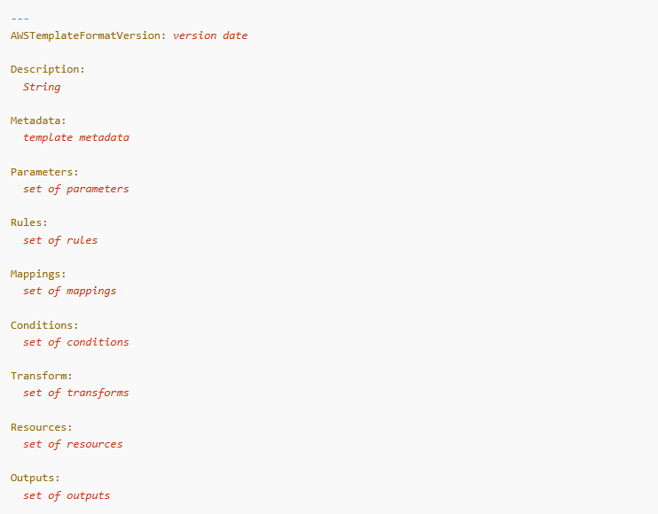
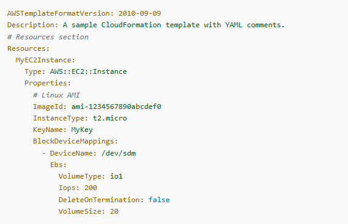

## Modelos CloudFormation

### Estrutura do Modelo

Os modelos do CloudFormation são divididos em seções diferentes, e cada seção se destina a conter um tipo específico de informação. Algumas seções devem ser declaradas em uma ordem específica e, para outras, a ordem não importa.

No entanto, à medida que você cria o modelo, pode ser útil usar a ordem lógica dos exemplos a seguir, porque valores em uma seção podem fazer referência a valores de uma seção anterior.

> **Importante:** Ao criar modelos, não use seções importantes duplicadas (por exemplo, duplicar a seção `Resources`). Embora o CloudFormation possa aceitar o modelo, ele terá um comportamento indefinido ao processá-lo e poderá provisionar recursos incorretamente ou retornar erros inexplicáveis.

-----

### Exemplos de Estruturas de Modelo

#### JSON

O exemplo a seguir mostra a estrutura de um modelo no formato JSON com todas as seções disponíveis.

```

```


#### YAML

O exemplo a seguir mostra a estrutura de um modelo no formato YAML com todas as seções disponíveis.

```

```

-----

### Comentários

#### JSON

Em modelos formatados em JSON, **não há suporte a comentários**. No entanto, se for necessário incluir notas explicativas ou documentação, pode-se adicionar uma seção `Metadata`.

#### YAML

Nos modelos formatados em YAML, é possível incluir comentários em linha usando o símbolo `#`.

O exemplo a seguir mostra um modelo YAML com comentários em linha.

```

```
-----

### Especificações de Formato

O CloudFormation é compatível com as seguintes especificações de JSON e YAML:

#### JSON

O CloudFormation segue o padrão JSON ECMA-404. Para obter mais informações sobre o formato JSON, consulte [json.org](http://www.json.org).

#### YAML

O CloudFormation é compatível com a especificação do YAML versão 1.1, com algumas exceções. O CloudFormation **não** é compatível com os seguintes recursos:

  * Tags `binary`, `omap`, `pairs`, `set` e `timestamp`
  * Aliases
  * Mesclagens de hash
